# SWM SEIL Common - Sales Workflow Management Salesforce ETL Integration Layer

**A comprehensive AWS-based serverless infrastructure for managing Salesforce data pipelines, multi-platform integrations, and enterprise data warehouse synchronization.**

**Status:** Production-ready | **Version:** 1.0.0 | **Primary Runtime:** Python 3.9+ | **Infrastructure:** AWS CloudFormation

---

## Table of Contents

1. [Overview](#overview)
2. [Architecture at a Glance](#architecture-at-a-glance)
3. [Repository Structure](#repository-structure)
4. [How It Works: Deep Dive](#how-it-works-deep-dive)
5. [Workflow Diagrams](#workflow-diagrams)
6. [Installation & Setup](#installation--setup)
7. [Usage & Examples](#usage--examples)
8. [Testing & Quality](#testing--quality)
9. [Troubleshooting](#troubleshooting)
10. [Extending the Project](#extending-the-project)
11. [Security & Secrets Management](#security--secrets-management)
12. [Contributing Guidelines](#contributing-guidelines)
13. [CI/CD & Deployment](#cicd--deployment)
14. [Appendix](#appendix)

---

## Overview

### What This Project Does

SWM SEIL Common is a **multi-environment Salesforce-to-Data-Warehouse integration platform** built on AWS infrastructure-as-code. It orchestrates:

- **Salesforce Data Ingestion:** Real-time and batch data flows from Salesforce via AWS AppFlow into S3 data lakes
- **Multi-Platform Integrations:** Bidirectional sync with Google Ad Manager (GAM) and Tech1 advertising platforms
- **Intelligent ETL Processing:** Apache Spark-powered Glue jobs for complex data transformations and schema mapping
- **Enterprise API Layer:** Router-based Lambda microservices for request handling, validation, and downstream service orchestration
- **Event-Driven Architecture:** Event-based processing via EventBridge for scalable, decoupled system components

### Key Features

- 🏗️ **Infrastructure-as-Code:** 100% CloudFormation-managed infrastructure across dev/non-prod/prod environments
- 🔄 **Bidirectional Sync:** Seamless Salesforce ↔ Data Warehouse ↔ External Platforms synchronization
- 📊 **Scalable ETL:** Apache Spark (AWS Glue) for large-scale data transformations (terabytes scale)
- 🔐 **Enterprise Security:** Cognito authorization, VPC isolation, KMS encryption, WAF protection
- 🔌 **Modular Services:** Microservices architecture with shared libraries for consistency
- 📈 **Multi-Environment Ready:** Automated deployment to dev/non-prod/production in separate AWS accounts
- 🚀 **CI/CD Integrated:** Azure DevOps pipelines for automated testing, building, and deployment
- 📝 **Comprehensive Monitoring:** CloudWatch logs, X-Ray tracing, EventBridge audit trail

### Who It's For

- **Data Engineers:** Building and maintaining ETL pipelines for Salesforce integrations
- **Cloud Architects:** Designing multi-tenant, multi-environment AWS infrastructure
- **DevOps/SRE:** Managing infrastructure deployment and monitoring
- **Backend Developers:** Extending API services and business logic
- **New Contributors:** Onboarding into enterprise Salesforce integration patterns

---

## Architecture at a Glance

### Component Overview

| Component | Purpose | Location | Tech Stack |
|-----------|---------|----------|-----------|
| **Salesforce AppFlow** | Scheduled data ingestion from Salesforce | AWS AppFlow Service | AWS-managed |
| **Ingestion Lambda** | S3 event processing, data validation, routing | `lambda/sf-to-dw/ingest/` | Python 3.9, boto3 |
| **Router Services** | API endpoint handlers, request routing | `lambda/api/{service}-router-service/` | Python 3.9, boto3, FastAPI-style |
| **Client Services** | Downstream microservices, business logic execution | `lambda/api/{service}-client-service/` | Python 3.9, boto3 |
| **Glue ETL Modules** | Large-scale data transformations, Salesforce object mapping | `glue/etl/Modules/` | Apache Spark, Python 3.9 |
| **Shared Libraries** | Common functionality (auth, Salesforce, GAM) | `lib/{auth,salesforce,gam,tech1-ci}/` | Python 3.9, Poetry |
| **EventBridge** | Event routing and audit trail | AWS EventBridge Service | AWS-managed |
| **S3 Data Lakes** | Landing, processed, curated data storage | AWS S3 | AWS-managed |
| **CloudFormation** | Infrastructure definition as code | `cfn/templates/` | CloudFormation YAML |
| **CI/CD Pipelines** | Build, test, deploy automation | `pipelines/` | Azure DevOps YAML |

### High-Level System Architecture

```mermaid
graph TB
    SalesforceOrg["🏢 Salesforce Org"]
    AppFlowService["AppFlow Service<br/>(AWS Managed)"]
    LandingS3["S3 Landing Bucket<br/>(Raw Parquet)"]
    IngestionLambda["Ingestion Lambda<br/>(Validation & Routing)"]
    ErrorBucket["S3 Error Bucket<br/>(Failed Items)"]
    ProcessedBucket["S3 Processed Bucket<br/>(Validated Data)"]
    CuratedBucket["S3 Curated Bucket<br/>(Transformed Data)"]
    EventBus["EventBridge Bus<br/>(Event Router)"]
    GlueLambda["Glue ETL Job<br/>(Spark Processing)"]
    DataWarehouse["Data Warehouse<br/>(DW System)"]
    APIGateway["API Gateway<br/>(HTTP Entry)"]
    RouterService["Router Service Lambda<br/>(Request Handler)"]
    ClientService["Client Service Lambda<br/>(Business Logic)"]
    ExternalPlatforms["External Platforms<br/>(GAM, Tech1, etc)"]

    SalesforceOrg -->|Schedule| AppFlowService
    AppFlowService -->|Parquet Files| LandingS3
    LandingS3 -->|S3 Event| EventBus
    EventBus -->|Trigger| IngestionLambda
    IngestionLambda -->|Valid| ProcessedBucket
    IngestionLambda -->|Validation| CuratedBucket
    IngestionLambda -->|Invalid| ErrorBucket
    EventBus -->|Audit Trail| CloudWatch["CloudWatch Logs"]
    CuratedBucket -->|Schedule| GlueLambda
    GlueLambda -->|Transform| DataWarehouse
    APIGateway -->|HTTP Request| RouterService
    RouterService -->|Invoke| ClientService
    ClientService -->|API Call| ExternalPlatforms
    RouterService -->|Response| APIGateway

    style SalesforceOrg fill:#0066cc
    style AppFlowService fill:#ff9900
    style LandingS3 fill:#ff9900
    style IngestionLambda fill:#ff9900
    style GlueLambda fill:#ff9900
    style DataWarehouse fill:#0066cc
    style APIGateway fill:#ff9900
    style RouterService fill:#ff9900
    style ExternalPlatforms fill:#0066cc
    style EventBus fill:#ff9900
```



---

## Repository Structure

```
SWM_SEIL_Common_CFN/
├── r2_seil_common/                          # Main project root
│   ├── README.md                            # Quick start guide
│   ├── python-code-check.sh                 # Linting and code quality script
│   ├── bandit.yaml                          # Security scanning config
│   ├── bandit-default.yaml                  # Security scanning defaults
│   │
│   ├── cfn/                                 # Infrastructure-as-Code (CloudFormation)
│   │   ├── parameters/                      # Environment-specific parameters
│   │   │   ├── dev-ssmParameters.yaml       # Development SSM parameters
│   │   │   ├── nonprod-ssmParameters.yaml   # Non-production parameters
│   │   │   └── prod-ssmParameters.yaml      # Production parameters
│   │   └── templates/                       # CloudFormation templates
│   │       ├── api/                         # API Gateway infrastructure
│   │       │   ├── apigateway.yaml          # API Gateway + Cognito + ALB
│   │       │   ├── gam-client-service.yaml  # GAM microservice stack
│   │       │   └── ...
│   │       ├── platform/                    # Platform-wide resources
│   │       │   ├── environment.yaml         # Environment stack
│   │       │   ├── account.yaml             # Account-level resources
│   │       │   └── account-azureDevOps.yaml # Azure DevOps integration
│   │       ├── sf-to-dw/                    # Salesforce → DW pipeline
│   │       ├── gam-to-sf/                   # GAM → Salesforce pipeline
│   │       └── sf-to-t1/                    # Salesforce → Tech1 pipeline
│   │
│   ├── lambda/                              # Lambda Functions (Python)
│   │   ├── README.md                        # Lambda development guide
│   │   ├── Dockerfile                       # Production Lambda image
│   │   ├── Dockerfile.test                  # Test Lambda image
│   │   ├── tasks.py                         # Invoke/build automation
│   │   │
│   │   ├── api/                             # API endpoint services
│   │   │   ├── gam-router-service/          # GAM request router
│   │   │   │   ├── app/lambda_handler.py    # Handler entry point
│   │   │   │   ├── app/core/                # Business logic
│   │   │   │   ├── pyproject.toml           # Poetry dependencies
│   │   │   │   └── tests/                   # Unit tests
│   │   │   ├── gam-client-service/          # GAM microservice logic
│   │   │   ├── tech1-router-service/        # Tech1 request router
│   │   │   ├── tech1-client-service/        # Tech1 microservice logic
│   │   │
│   │   ├── sf-to-dw/                        # Salesforce → DW Lambda
│   │   │   └── ingest/                      # Ingestion handler
│   │   │
│   │   ├── gam-to-sf/                       # GAM → Salesforce Lambda
│   │   │   └── delivery-reporting/          # Delivery report processor
│   │   │
│   │   ├── sf-to-t1/                        # Salesforce → Tech1 Lambda
│   │   │   └── billing/                     # Billing processor
│   │   │
│   │   ├── utilities/                       # Utility functions
│   │   │   ├── activateflows/               # AppFlow activation
│   │   │   └── appflowmultiply/             # AppFlow scaling
│   │   │
│   │   └── demo/                            # Demo/template services
│   │       ├── hello/                       # Hello world Lambda
│   │       └── ingest/                      # Sample ingestion handler
│   │
│   ├── glue/                                # AWS Glue ETL Jobs (Apache Spark)
│   │   ├── README.md                        # Glue development guide
│   │   ├── Dockerfile                       # Glue local test environment
│   │   │
│   │   ├── etl/Modules/                     # Spark transformation modules
│   │   │   ├── Sales_Order_Accounts_Map.py  # Salesforce Account → S3
│   │   │   ├── Sales_Order_Contacts_Map.py  # Salesforce Contact → S3
│   │   │   ├── Sales_Order.py               # Order processing
│   │   │   ├── Product.py                   # Product catalog sync
│   │   │   ├── Production_Line_Item.py      # Line item transformation
│   │   │   ├── Ad_Slot.py                   # Ad slot mapping
│   │   │   ├── Sales_Order_Type.py          # Order type classification
│   │   │   └── ... (13 total modules)
│   │   │
│   │   ├── demo/                            # Demo Glue jobs
│   │   │   └── hello/                       # Sample Glue job
│   │   │
│   │   └── tests/                           # Glue testing setup
│   │       ├── conftest.py                  # Pytest configuration
│   │       ├── util.py                      # Test utilities
│   │       └── demo/                        # Demo tests
│   │
│   ├── lib/                                 # Shared Python Libraries (Poetry packages)
│   │   ├── auth/                            # Authentication library
│   │   │   ├── pyproject.toml               # Package definition
│   │   │   ├── auth_client/                 # OAuth2/JWT handling
│   │   │   └── tests/                       # Auth tests
│   │   │
│   │   ├── common/                          # Common utilities
│   │   │   ├── pyproject.toml
│   │   │   ├── core/                        # Core utilities
│   │   │   └── tests/
│   │   │
│   │   ├── salesforce/                      # Salesforce SDK
│   │   │   ├── pyproject.toml
│   │   │   └── salesforce_core/             # Salesforce API client
│   │   │
│   │   ├── gam/                             # Google Ad Manager SDK
│   │   │   ├── pyproject.toml
│   │   │   ├── gam_core/                    # GAM API interactions
│   │   │   └── tests/
│   │   │
│   │   └── tech1-ci/                        # Tech1 integration library
│   │       ├── pyproject.toml
│   │       ├── tech1_ci/                    # Tech1 API client
│   │       └── tests/
│   │
│   ├── docs/                                # Comprehensive documentation
│   │   ├── README.md
│   │   ├── APIGateway.md                    # API Gateway + ALB architecture
│   │   ├── Networking.md                    # VPC/Subnet CIDR ranges
│   │   ├── bootstrapping.md                 # Account setup guide
│   │   ├── KeyPolicies.md                   # KMS key policies
│   │   ├── NACLs.md                         # Network ACLs
│   │   ├── Naming.md                        # Naming conventions
│   │   ├── VirtualGateway.md                # Virtual appliance setup
│   │   ├── AwsShield.md                     # DDoS protection
│   │   ├── AzureDevOpsIntegration.md        # CI/CD setup
│   │   ├── PythonCodeQualityCheck.md        # Code quality tools
│   │   ├── SchemaTransformationPoc.md       # Schema mapping PoC
│   │   ├── img/                             # Documentation images
│   │   └── integrations/                    # Integration-specific docs
│   │       ├── sf_to_dw.md                  # Salesforce → DW flow
│   │       ├── sf-api.yaml                  # Salesforce API specs
│   │       ├── gam-to-sf.yaml               # GAM → Salesforce flow
│   │       └── sf-to-t1.yaml                # Salesforce → Tech1 flow
│   │
│   ├── pipelines/                           # CI/CD Pipeline Definitions (Azure DevOps)
│   │   ├── README.md                        # Pipeline documentation
│   │   ├── account-create-update-stack.yaml # Account-level CFN deployment
│   │   ├── environment-create-update-stack.yaml # Env-level CFN deployment
│   │   ├── delete-stack.yaml                # Stack cleanup
│   │   ├── glue-local-docker-build.yaml     # Local Glue testing
│   │   ├── python-code-quality-check.yaml   # Code quality checks
│   │   │
│   │   ├── platform/                        # Platform pipelines
│   │   │   ├── account.yaml                 # Account pipeline
│   │   │   └── environment.yaml             # Environment pipeline
│   │   │
│   │   ├── integrations/                    # Integration-specific pipelines
│   │   │   ├── gam-to-sf.yaml               # GAM → SF deploy
│   │   │   ├── sf-api.yaml                  # SF API deploy
│   │   │   ├── sf-to-dw.yaml                # SF → DW deploy
│   │   │   └── sf-to-t1.yaml                # SF → Tech1 deploy
│   │   │
│   │   └── templates/                       # Reusable pipeline templates
│   │       └── lambda-build.yaml            # Lambda build template
│   │
│   └── resources/                           # Static resources
│       ├── glue/                            # Glue job resources
│       │   └── extraLibs/                   # Extra libraries for Glue
│       └── openapi/                         # OpenAPI specifications
│           ├── apigateway/                  # API Gateway specs
│           └── external/                    # External service specs

```

**Key Files Directory Reference:**

| Purpose | Location |
|---------|----------|
| Lambda handler entry point | `lambda/api/*/app/lambda_handler.py` |
| Glue transformation logic | `glue/etl/Modules/{ObjectName}.py` |
| Shared utilities | `lib/{component}/` |
| Infrastructure templates | `cfn/templates/{service}/` |
| Environment parameters | `cfn/parameters/{env}-ssmParameters.yaml` |
| CI/CD pipelines | `pipelines/*.yaml` |
| Deployment documentation | `docs/{feature}.md` |

---

## How It Works: Deep Dive

### 1. Core Workflow: Salesforce Data Ingestion

#### Step 1: Data Extraction (AppFlow)
```
[Salesforce Org] 
    ↓ (scheduled sync via AppFlow connector)
[S3 Landing Bucket] (/in folder, parquet format)
```

**Location:** AWS AppFlow Service (AWS-managed)

**What happens:**
- AppFlow runs on a configured schedule (configurable per object)
- For **full loads:** All Salesforce object records are exported as parquet files
- For **delta loads:** Only records changed in the previous hour are exported
- Files are written directly to the **S3 landing bucket** under `/in` folder
- Example: `s3://swm-adsales-sales-orders-landing/in/Sales_Order/2026-02-26-12-00-00.parquet`

---

#### Step 2: Event Notification & Validation (Ingestion Lambda)
```
[S3 Landing Bucket] 
    ↓ (S3 PUT event)
[EventBridge Bus]
    ↓ (forward event)
[Ingestion Lambda: sf-to-dw/ingest]
```

**Location:** [`lambda/sf-to-dw/ingest/`](lambda/sf-to-dw/ingest/)

**Handler Logic Flow:**

```python
def handler(event, context):
    1. Extract S3 object metadata (bucket, key, file size)
    2. Perform sanity checks:
       - File format validation (must be parquet)
       - File size check (min threshold)
       - Salesforce object type validation
       - Row count verification
    3. If ANY check fails:
       - Log error to CloudWatch
       - Send error event to EventBridge Bus
       - Move file to S3 error bucket under /error/{hour}
       - Return error response
    4. If ALL checks pass:
       - Move file to S3 processed bucket under /processed/{hour}
       - Add traceability fields (filename, timestamp, processing ID)
       - Write enhanced data to S3 curated bucket
       - Send success event to EventBridge Bus
       - Return success response
```

**Example Code Context:**

```python
# From: lambda/sf-to-dw/ingest/app/lambda_handler.py
session_destination = boto3.session.Session(
    aws_access_key_id="[REDACTED_AWS_ACCESS_KEY]",
    region_name="ap-southeast-2",
    aws_secret_access_key="[REDACTED_AWS_SECRET_KEY]"
)
```

---

#### Step 3: Event Routing
```
[Ingestion Lambda] 
    ↓ (PutEvent)
[EventBridge: env-sf-to-dw bus]
    ├─→ [ETL Trigger Rule] → [Glue Job]
    └─→ [Logging Rule] → [CloudWatch Logs: /aws/events/env-sf-to-dw]
```

**Location:** CloudFormation: `cfn/templates/sf-to-dw/`

**Event Bus Configuration:**
- Event bus name: `{environment}-sf-to-dw` (e.g., `dev-sf-to-dw`)
- All events are logged to CloudWatch for audit trail
- Multiple rules can subscribe to events for parallel processing

---

#### Step 4: ETL Transformation (Glue Job)
```
[S3 Curated Bucket] 
    ↓ (triggered schedule or EventBridge)
[Glue Job: Apache Spark]
    ├─ Read parquet files
    ├─ Apply Salesforce object mapping
    ├─ Transform schema
    └─ Write to Data Warehouse
```

**Location:** [`glue/etl/Modules/`](glue/etl/Modules/)

**Example: Sales Order Processing**

**File:** [`glue/etl/Modules/Sales_Order_Accounts_Map.py`](glue/etl/Modules/Sales_Order_Accounts_Map.py)

**Processing Steps:**

```python
from awsglue.context import GlueContext
from pyspark.context import SparkContext

# Initialize Spark and Glue contexts
sc = SparkContext()
glueContext = GlueContext(sc)
spark = glueContext.spark_session

# Step 1: Read Salesforce Account data from catalog
Account = glueContext.create_dynamic_frame.from_catalog(
    database="valid-sf-db",
    table_name="salesforce_account",
    transformation_ctx="Account"
)

# Step 2: Read Salesforce Order data from catalog
Order = glueContext.create_dynamic_frame.from_catalog(
    database="valid-sf-db",
    table_name="salesforce_order",
    transformation_ctx="Order"
)

# Step 3: Apply field mapping & rename columns
RenamedAccount = ApplyMapping.apply(
    frame=Account,
    mappings=[
        ("id", "string", "`(a) id`", "string"),
        ("name", "string", "`(a) name`", "string"),
        # ... (40+ field mappings)
    ]
)

# Step 4: Join Account and Order data
JoinedData = Join.apply(
    frame1=RenamedAccount,
    frame2=Order,
    keys1=["(a) id"],
    keys2=["account_id"]
)

# Step 5: Filter and transform
FilteredData = Filter.apply(
    frame=JoinedData,
    f=lambda x: x["is_deleted"] == "N"
)

# Step 6: Write to destination (S3 or Data Warehouse)
glueContext.write_dynamic_frame.from_options(
    frame=FilteredData,
    connection_type="s3",
    connection_options={"path": "s3://destination-dw-bucket/processed/"},
    format="parquet"
)

job.commit()
```

**Modules Available:**

| Module | Purpose | Input | Output |
|--------|---------|-------|--------|
| `Sales_Order_Accounts_Map.py` | Map Salesforce Accounts to Orders | Salesforce Account + Order | Mapped Account-Order records |
| `Sales_Order_Contacts_Map.py` | Map Salesforce Contacts to Orders | Salesforce Contact + Order | Mapped Contact-Order records |
| `Sales_Order.py` | Process and validate Sales Orders | Salesforce Order | Validated Order records |
| `Product.py` | Product catalog synchronization | Salesforce Product | Product master records |
| `Production_Line_Item.py` | Line item transformation | Salesforce Item + Production data | Line item records |
| `Ad_Slot.py` | Ad inventory mapping | Salesforce Ad Slot | Mapped Ad Slot records |
| (13 total modules for different Salesforce objects) | | | |

---

### 2. Core Workflow: API Request Handling

#### Architecture: Router + Client Pattern

```
[API Gateway / Load Balancer]
    ↓ (HTTP Request: POST /orders/create)
[Router Service Lambda]
    ├─ Extract headers, validate auth token
    ├─ Validate request body schema
    ├─ Extract correlation ID
    ├─ Invoke Client Service Lambda
    └─ Return response to caller
        ↓
[Client Service Lambda]
    ├─ Execute business logic
    ├─ Call external APIs (Salesforce, GAM, etc.)
    └─ Return result to Router
        ↓
[Router formats response]
    ↓
[HTTP Response]
```

**Location:** [`lambda/api/`](lambda/api/)

**Example: GAM Router Service**

**File:** [`lambda/api/gam-router-service/app/lambda_handler.py`](lambda/api/gam-router-service/app/lambda_handler.py)

```python
@xray_recorder.capture("lambda_handler.handler")
@inject
def handler(event, context):
    """
    Main Lambda handler for router service.
    
    Args:
        event: ALB/API Gateway event containing request
        context: Lambda context object
    
    Returns:
        HTTP response with status code, headers, and body
    """
    start_time = time.time()
    
    # 1. Extract transaction context (correlation ID, app label, method)
    transaction_context = txcontext.TransactionContext(event, context)
    headers = {
        "X-Correlation-Id": transaction_context.get_correlationId(),
        "X-Application-Label": transaction_context.get_applicationLabel()
    }
    
    # 2. Validate HTTP method and request body presence
    http_method = transaction_context.get_method()
    if (http_method in ["POST", "PATCH"]) and body_missing:
        return response_mapper.create_validation_error_response(
            transaction_context, 
            "Missing body"
        )
    
    # 3. Parse request body and extract query parameters
    downstream_request = {
        "headers": headers,
        "queryStringParameters": event.get("queryStringParameters", {}),
        "body": json.loads(event.get("body", "{}")),
        "transactionContext": transaction_context.get_context()
    }
    
    # 4. Invoke client service with retry logic
    retry_max = 3
    retry_interval = 5
    for attempt in range(retry_max):
        try:
            invoke_response = lambda_client.invoke(
                FunctionName=arn_gam_service,
                Payload=json.dumps(downstream_request)
            )
            break
        except CodeArtifactUserPendingException as e:
            if attempt < retry_max - 1:
                time.sleep(retry_interval)
            else:
                raise
    
    # 5. Process and return response
    lambda_response_payload = json.loads(invoke_response["Payload"].read())
    
    if lambda_response_payload.get("code") is None:
        error_msg = lambda_response_payload.get("errorMessage", "Processing failure")
        return response_mapper.create_server_error_response(
            transaction_context, error_msg
        )
    
    return response_mapper.create_lambda_response(lambda_response_payload)
```

**Project Structure:**

| Service | Purpose | Handler | Business Logic |
|---------|---------|---------|-----------------|
| `gam-router-service` | Route GAM requests | `app/lambda_handler.py` | `app/core/` |
| `gam-client-service` | Execute GAM operations | `app/lambda_handler.py` | GAM API calls |
| `tech1-router-service` | Route Tech1 requests | `app/lambda_handler.py` | `app/core/` |
| `tech1-client-service` | Execute Tech1 operations | `app/lambda_handler.py` | Tech1 API calls |

---

### 3. Shared Libraries

**Location:** [`lib/`](lib/)

#### Authentication Library (`lib/auth/`)

**Purpose:** OAuth2/JWT token handling and request signing

**Key Components:**
- JWT bearer token generation
- Service account authentication
- Request signature calculation (AWS SigV4)

#### Common Library (`lib/common/`)

**Purpose:** Shared utilities and helpers

**File:** `lib/common/core/`

Contains utilities for:
- HTTP response mapping
- Error handling
- Validation functions
- Transaction context management
- Configuration extraction

#### Salesforce Library (`lib/salesforce/`)

**Purpose:** Salesforce API client and authentication

**File:** `lib/salesforce/salesforce_core/`

**Features:**
- JWT bearer token flow for Service Cloud
- Secrets Manager integration
- Object query builders
- Bulk API support

#### GAM Library (`lib/gam/`)

**Purpose:** Google Ad Manager integration

**File:** `lib/gam/gam_core/`

**Features:**
- GAM API client
- Inventory management
- Trafficking operations
- Report generation

#### Tech1 Integration Library (`lib/tech1-ci/`)

**Purpose:** Tech1 platform integration

**File:** `lib/tech1-ci/tech1_ci/`

**Features:**
- Tech1 API authentication
- Order management
- Billing operations

---

### 4. Infrastructure Setup (CloudFormation)

**Location:** [`cfn/templates/`](cfn/templates/)

#### Key Templates

| Template | Purpose | Environment | Location |
|----------|---------|-------------|----------|
| `platform/account-azureDevOps.yaml` | Azure DevOps service connection IAM setup | Account-level | Single setup per account |
| `platform/environment.yaml` | VPC, subnets, security groups, KMS keys | Environment-level | Deployed to each env (dev, nonprod, prod) |
| `platform/environment-ecr.yaml` | ECR repositories for Docker images | Environment-level | Each environment |
| `api/apigateway.yaml` | API Gateway, Cognito, ALB, WAF | Environment + Service | Deployed per service per env |
| `sf-to-dw/` | Salesforce → DW EventBridge, Lambdas | Environment | Deployed once per environment |
| `gam-to-sf/` | GAM → Salesforce integration | Environment | Deployed once per environment |
| `sf-to-t1/` | Salesforce → Tech1 integration | Environment | Deployed once per environment |

**Deployment Process:**

```bash
# Step 1: Deploy account-level stack (one-time per AWS account)
aws cloudformation update-stack \
  --capabilities CAPABILITY_IAM CAPABILITY_NAMED_IAM CAPABILITY_AUTO_EXPAND \
  --stack-name account-azureDevOps \
  --template-body "$(cat cfn/templates/platform/account-azureDevOps.yaml)"

# Step 2: Deploy environment stack (once per environment: dev, nonprod, prod)
aws cloudformation update-stack \
  --capabilities CAPABILITY_IAM CAPABILITY_NAMED_IAM CAPABILITY_AUTO_EXPAND \
  --stack-name platform-dev-environment \
  --template-body "$(cat cfn/templates/platform/environment.yaml)" \
  --parameters ParameterKey=EnvPrefix,ParameterValue=dev

# Step 3: Deploy integration-specific stacks
aws cloudformation update-stack \
  --capabilities CAPABILITY_IAM CAPABILITY_NAMED_IAM CAPABILITY_AUTO_EXPAND \
  --stack-name dev-sf-to-dw \
  --template-body "$(cat cfn/templates/sf-to-dw/main.yaml)" \
  --parameters ParameterKey=EnvPrefix,ParameterValue=dev
```

---

## Workflow Diagrams

### Diagram 1: Salesforce Data Ingestion End-to-End Flow


### Diagram 2: API Request Handler Flow (Router + Client Pattern)


### Diagram 3: Data Architecture & Component Relationships

```mermaid
graph TB
    subgraph "Data Sources"
        SF["☁️ Salesforce Org<br/>(Accounts, Orders, Products, etc)"]
        GAM["☁️ Google Ad Manager<br/>(Ad Slots, Inventory, Campaigns)"]
        T1["☁️ Tech1 Platform<br/>(Billing, Delivery)"]
    end

    subgraph "Ingestion Layer"
        AF["📤 AppFlow<br/>(Scheduled sync)"]
        IL["⚡ Ingestion Lambda<br/>(Data validation)"]
    end

    subgraph "Storage Layer"
        S3LZ["📦 S3 Landing<br/>(Raw parquet)"]
        S3P["📦 S3 Processed<br/>(Validated)"]
        S3C["📦 S3 Curated<br/>(Transformed)"]
        S3E["📦 S3 Error<br/>(Failed items)"]
    end

    subgraph "Transformation Layer"
        GJ1["⚙️ Glue: Sales_Order<br/>(Order mapping)"]
        GJ2["⚙️ Glue: Product<br/>(Catalog sync)"]
        GJ3["⚙️ Glue: Contact Map<br/>(Contact sync)"]
        GJN["⚙️ Glue: N ETL Jobs<br/>(Other objects)"]
    end

    subgraph "Delivery Layer"
        DW["💾 Data Warehouse<br/>(Analytics DB)"]
        SFAPI["☁️ Salesforce API<br/>(Update SF)"]
        GAMAPI["☁️ GAM API<br/>(Trafficking)"]
    end

    subgraph "API Services"
        RS["🔀 Router Services<br/>(gam-router, tech1-router)"]
        CS["💼 Client Services<br/>(gam-client, tech1-client)"]
    end

    subgraph "Infrastructure"
        AG["🌐 API Gateway"]
        ALB["⚖️ Application Load Balancer"]
        EB["🔔 EventBridge<br/>(Event Bus)"]
        CW["📊 CloudWatch<br/>(Logs & Monitoring)"]
        KMS["🔐 KMS<br/>(Encryption)"]
    end

    SF -->|via AppFlow| AF
    AF -->|write| S3LZ
    S3LZ -->|notify| IL
    IL -->|route| S3P
    IL -->|route| S3C
    IL -->|route| S3E
    IL -->|emit event| EB
    EB -->|audit| CW
    EB -->|trigger| GJ1
    EB -->|trigger| GJ2
    EB -->|trigger| GJ3
    EB -->|trigger| GJN

    S3C -->|read| GJ1
    S3C -->|read| GJ2
    S3C -->|read| GJ3
    S3C -->|read| GJN

    GJ1 -->|write| DW
    GJ2 -->|write| DW
    GJ3 -->|write| DW
    GJN -->|write| DW

    AG -->|route| RS
    ALB -->|accept| CW
    RS -->|invoke| CS
    CS -->|call| SFAPI
    CS -->|call| GAMAPI
    CS -->|call| SFAPI

    AG -->|auth| CW
    ALB -->|request| AG
    GJ1 -->|encrypt| KMS
    GJ2 -->|encrypt| KMS
    S3LZ -->|encrypt| KMS

    style SF fill:#0066cc,color:#fff
    style GAM fill:#0066cc,color:#fff
    style T1 fill:#0066cc,color:#fff
    style AF fill:#ff9900,color:#000
    style IL fill:#ff9900,color:#000
    style S3LZ fill:#ff9900,color:#000
    style S3C fill:#ff9900,color:#000
    style GJ1 fill:#ff9900,color:#000
    style DW fill:#0066cc,color:#fff
    style AG fill:#ff9900,color:#000
    style ALB fill:#ff9900,color:#000
    style EB fill:#ff9900,color:#000
```



---

## Installation & Setup

### Prerequisites

- **AWS Account** with appropriate IAM permissions
- **Python 3.9+** (for Lambda and Glue development)
- **Poetry** (Python dependency management)
- **Docker** (for local Lambda/Glue testing)
- **AWS CLI** configured with credentials
- **Azure DevOps** project (for CI/CD)
- **Git** (version control)

### Step 1: Clone Repository

```bash
git clone https://github.com/vjsniper02/SWM_SEIL_Common_CFN.git
cd SWM_SEIL_Common_CFN/r2_seil_common
```

### Step 2: Set Up Python Environment

```bash
# Create virtual environment (recommended)
python3 -m venv venv
source venv/bin/activate  # On macOS/Linux
# or
venv\Scripts\activate  # On Windows

# Install Poetry (if not installed)
pip install poetry==1.2.1

# Install project dependencies
poetry install
```

### Step 3: Configure AWS Credentials

```bash
# Configure AWS CLI
aws configure

# Or via environment variables
export AWS_ACCESS_KEY_ID="your-access-key"
export AWS_SECRET_ACCESS_KEY="your-secret-key"
export AWS_DEFAULT_REGION="ap-southeast-2"

# Verify configuration
aws sts get-caller-identity
```

### Step 4: Bootstrap AWS Account (One-Time)

**Create Azure DevOps Service Connection:**

```bash
cd cfn/templates/platform

# Deploy account-level CloudFormation stack
aws cloudformation update-stack \
  --capabilities CAPABILITY_IAM CAPABILITY_NAMED_IAM CAPABILITY_AUTO_EXPAND \
  --stack-name account-azureDevOps \
  --template-body "$(cat account-azureDevOps.yaml)"

# Wait for stack to complete
aws cloudformation wait stack-update-complete --stack-name account-azureDevOps

# Retrieve credentials
CREDENTIALS=$(aws secretsmanager get-secret-value \
  --secret-id CloudFormationAzdo \
  --query SecretString \
  --output text)

# Use credentials to create Azure DevOps service connection
# (See docs/AzureDevOpsIntegration.md for detailed steps)
```

**Set Up Networking (VPC, Subnets):**

```bash
# Review network parameters
cat cfn/parameters/dev-ssmParameters.yaml

# Deploy platform stack with environment
aws cloudformation update-stack \
  --capabilities CAPABILITY_IAM CAPABILITY_NAMED_IAM CAPABILITY_AUTO_EXPAND \
  --stack-name platform-dev-network \
  --template-body "$(cat platform/environment.yaml)" \
  --parameters \
    ParameterKey=EnvPrefix,ParameterValue=dev \
    ParameterKey=Environment,ParameterValue=development

# Wait for stack to complete
aws cloudformation wait stack-update-complete --stack-name platform-dev-network
```

### Step 5: Create Salesforce AppFlow Connector (Manual)

1. Log into target Salesforce org
2. Go to **Setup** → **Integrations** → **Single Sign-On Settings**
3. Create a new connected app (for OAuth)
4. In AWS AppFlow console:
   - Click **Connectors**
   - Create new **Salesforce** connector
   - Use Salesforce org credentials
5. Store connector name in AWS Systems Manager Parameter Store:

```bash
aws ssm put-parameter \
  --name /dev/salesforce/connectorName \
  --value "my-salesforce-connector" \
  --type String \
  --overwrite
```

### Step 6: Deploy Integration Stacks

**Salesforce → Data Warehouse:**

```bash
cd cfn/templates/sf-to-dw

aws cloudformation update-stack \
  --capabilities CAPABILITY_IAM CAPABILITY_NAMED_IAM CAPABILITY_AUTO_EXPAND \
  --stack-name dev-sf-to-dw \
  --template-body "$(cat main.yaml)" \
  --parameters ParameterKey=EnvPrefix,ParameterValue=dev
```

**API Services:**

```bash
cd cfn/templates/api

aws cloudformation update-stack \
  --capabilities CAPABILITY_IAM CAPABILITY_NAMED_IAM CAPABILITY_AUTO_EXPAND \
  --stack-name dev-apigateway \
  --template-body "$(cat apigateway.yaml)" \
  --parameters ParameterKey=EnvPrefix,ParameterValue=dev
```

### Step 7: Build and Deploy Lambda Functions

```bash
cd lambda

# Install invoke and dependencies
pip install invoke==1.7.1 poetry==1.2.1

# Build specific Lambda service
inv build --fn api/gam-router-service \
          --dockertag gam-router-service:dev \
          --reportsdir test-reports

# Tag and push to ECR
aws ecr get-login-password --region ap-southeast-2 | \
  docker login --username AWS --password-stdin {account-id}.dkr.ecr.ap-southeast-2.amazonaws.com

docker tag gam-router-service:dev \
  {account-id}.dkr.ecr.ap-southeast-2.amazonaws.com/gam-router-service:latest

docker push {account-id}.dkr.ecr.ap-southeast-2.amazonaws.com/gam-router-service:latest
```

### Step 8: Verify Deployment

```bash
# Check CloudFormation stacks
aws cloudformation list-stacks --stack-status-filter CREATE_COMPLETE UPDATE_COMPLETE

# Check Lambda functions
aws lambda list-functions --query 'Functions[?contains(FunctionName, `gam-`) || contains(FunctionName, `tech1-`)]'

# Check EventBridge rules
aws events list-rules --name-prefix dev-

# Check S3 buckets
aws s3 ls | grep -E 'landing|processed|curated'
```

---

## Usage & Examples

### Example 1: Trigger Salesforce Data Sync

**Manual AppFlow Run:**

```bash
# List available flows
aws appflow describe-flows --query 'flows[*].[FlowName, FlowStatus]'

# Start specific flow
aws appflow start-flow --flow-name {flow-name}

# Monitor flow execution
aws appflow describe-flow-execution-records --flow-name {flow-name}
```

### Example 2: Test Lambda Handler Locally

**Using Docker:**

```bash
cd lambda

# Build test image
docker build -f Dockerfile.test -t lambda-test:latest .

# Run container
docker run -v ~/.aws/credentials:/root/.aws/credentials \
           -p 9000:8080 \
           lambda-test:latest

# In another terminal, test handler
curl -XPOST "http://localhost:9000/2015-03-31/functions/function/invocations" \
     -d '{
       "httpMethod": "GET",
       "path": "/orders/123",
       "headers": {"Authorization": "Bearer token"}
     }'
```

**Expected Response:**

```json
{
  "statusCode": 200,
  "body": {
    "orderId": "123",
    "status": "SUCCESS",
    "data": { ... }
  },
  "headers": {
    "X-Correlation-Id": "uuid-1234-5678",
    "X-Application-Label": "gam-router"
  }
}
```

### Example 3: Query Data Warehouse

After successful ETL:

```sql
-- Query transformed Sales Orders
SELECT 
  o.order_id,
  o.account_name,
  o.order_date,
  COUNT(*) as line_item_count
FROM sales_orders o
JOIN sales_order_line_items li ON o.id = li.order_id
WHERE o.created_at >= CURRENT_DATE - INTERVAL '7 days'
GROUP BY o.id, o.account_name, o.order_date
ORDER BY o.order_date DESC;
```

### Example 4: Monitor ETL Job Progress

```bash
# List Glue jobs
aws glue list-jobs --query 'JobNames[?contains(@, `Sales_Order`)]'

# Get job runs with status
aws glue get-job-runs --job-name Sales_Order_Accounts_Map \
  --query 'JobRuns[*].[Id, State, StartedOn, CompletedOn]'

# Get detailed log output
aws logs tail /aws-glue/jobs/Sales_Order_Accounts_Map --follow
```

### Example 5: Test Ingestion Lambda Manually

**Create test S3 file:**

```bash
# Download sample Salesforce data
aws s3 cp s3://swm-adsales-sales-orders-landing/in/Account/sample.parquet ./

# Upload to trigger Lambda
aws s3 cp ./sample.parquet s3://swm-adsales-sales-orders-landing/in/Account/test-2026-02-26.parquet

# Check Lambda logs
aws logs tail /aws/lambda/sf-to-dw-ingest --follow

# Verify output in curated bucket
aws s3 ls s3://swm-adsales-sales-orders-curated/Account/ --recursive
```

---

## Testing & Quality

### Running Unit Tests

```bash
# Install test dependencies
pip install pytest pytest-cov pytest-mock moto

# Run all tests
pytest tests/ -v

# Run with coverage
pytest tests/ --cov=glue --cov=lambda --cov-report=html

# Run specific test file
pytest tests/test_lambda_handler.py -v
```

**Test Files Location:**

- **Lambda tests:** `lambda/api/*/tests/`
- **Glue tests:** `glue/tests/`
- **Library tests:** `lib/*/tests/`

### Code Quality Checks

```bash
# Run Python code quality check script
bash python-code-check.sh

# Or manually run tools:

# 1. Linting (flake8)
flake8 . --statistics

# 2. Security scanning (bandit)
bandit -r . -c bandit.yaml

# 3. Type checking (if using type hints)
mypy . --ignore-missing-imports

# 4. Code formatting (black)
black . --check && black .
```

**Configuration Files:**

- Bandit config: [`bandit.yaml`](bandit.yaml)
- Python formatting: Black (default settings)
- Linting: Flake8 (default settings)

### Continuous Integration (Azure DevOps)

**Pipeline Files:**

- Code quality check: [`pipelines/python-code-quality-check.yaml`](pipelines/python-code-quality-check.yaml)
- Lambda build: [`pipelines/templates/lambda-build.yaml`](pipelines/templates/lambda-build.yaml)
- Glue test: [`pipelines/glue-local-docker-build.yaml`](pipelines/glue-local-docker-build.yaml)

**Verification:**

```bash
# Check pipeline definition
cat pipelines/python-code-quality-check.yaml

# Trigger pipeline manually (via Azure DevOps CLI)
az pipelines run --name SWM-CodeQualityCheck --project SalesforceMiddleware
```

---

## Troubleshooting

### Issue 1: Lambda: "CodeArtifactUserPendingException"

**Symptom:** Lambda invocations fail with CodeArtifactUserPendingException

**Cause:** Lambda container is waking up or codepend initialization error

**Solution:**

```python
# Router service has built-in retry logic:
for attempt in range(3):
    try:
        invoke_response = lambda_client.invoke(...)
        break
    except CodeArtifactUserPendingException:
        if attempt < 2:
            time.sleep(5)  # Wait before retry
        else:
            raise
```

---

### Issue 2: CloudFormation Stack Fails with "failed to reach update completion status"

**Symptom:**

```
Stack update request failed with error:
Error: Stack platform-dev-ecr failed to reach update completion status,
error: 'Resource is not in the state stackUpdateComplete'
```

**Cause:** Stack is in ROLLBACK_IN_PROGRESS state

**Solution:**

```bash
# Option 1: Continue update
aws cloudformation continue-update-rollback \
  --stack-name platform-dev-ecr

# Option 2: Delete and redeploy
aws cloudformation delete-stack --stack-name platform-dev-ecr
aws cloudformation wait stack-delete-complete --stack-name platform-dev-ecr

# Option 3: Update manually from AWS CLI
aws cloudformation update-stack \
  --capabilities CAPABILITY_AUTO_EXPAND CAPABILITY_IAM CAPABILITY_NAMED_IAM \
  --stack-name platform-dev-ecr \
  --template-body "$(cat cfn/templates/platform/environment-ecr.yaml)" \
  --parameters ParameterKey=EnvPrefix,ParameterValue=dev
```

---

### Issue 3: Glue Job Fails: "Worker node capacity exceeded"

**Symptom:** Glue job terminates with executor memory/capacity issues

**Cause:** Spark executors running out of memory or too many partitions

**Solution:**

```bash
# Check Glue job configuration
aws glue get-job --name Sales_Order_Accounts_Map

# Update job configuration if needed
aws glue update-job --name Sales_Order_Accounts_Map \
  --job-update '{
    "Command": {
      "GlueVersion": "4.0",
      "PythonVersion": "3.9"
    },
    "MaxCapacity": 10,  # Increase DPU capacity
    "MaxRetries": 1,
    "Timeout": 3600
  }'

# Repartition data in Glue script
# In Glue module:
dynamic_frame = dynamic_frame.coalesce(200)  # Reduce partitions
```

---

### Issue 4: Ingestion Lambda: Files stuck in error bucket

**Symptoms:**

- Files accumulating in `/error` bucket
- CloudWatch logs show validation failures

**Troubleshooting:**

```bash
# 1. Check error bucket contents
aws s3 ls s3://swm-adsales-sales-orders-landing/error/ --recursive

# 2. Check CloudWatch logs for error details
aws logs tail /aws/lambda/sf-to-dw-ingest --follow

# 3. Get sample error file to inspect
aws s3 cp s3://swm-adsales-sales-orders-landing/error/2026-02-26-10/error-Sales_Order.json ./

# 4. Common validation failures:
#    - Field count mismatch: Check Salesforce schema in Glue catalog
#    - File size too small: Check AppFlow configuration
#    - Parquet format issue: Re-export from Salesforce

# 5. Once root cause fixed, manually retry files:
aws s3 mv s3://swm-adsales-sales-orders-landing/error/2026-02-26-10/error.parquet \
        s3://swm-adsales-sales-orders-landing/in/Account/retry-error.parquet
```

---

### Issue 5: API Gateway: 401 Unauthorized

**Symptom:** Requests to API endpoint return 401

**Cause:** Cognito token invalid or expired

**Solution:**

```bash
# 1. Generate new token
USER_POOL_ID=$(aws cognito-idp list-user-pools --max-results 10 \
  --query "UserPools[?Name=='SalesforceMiddleware'].Id" --output text)

CLIENT_ID=$(aws cognito-idp list-user-pool-clients \
  --user-pool-id $USER_POOL_ID \
  --query "UserPoolClients[0].ClientId" --output text)

# 2. Authenticate and get token
TOKEN=$(aws cognito-idp admin-initiate-auth \
  --user-pool-id $USER_POOL_ID \
  --client-id $CLIENT_ID \
  --auth-flow ADMIN_NO_SRP_AUTH \
  --auth-parameters USERNAME=testuser,PASSWORD=TempPassword123! \
  --query "AuthenticationResult.IdToken" --output text)

# 3. Test API with token
curl -H "Authorization: Bearer $TOKEN" \
     https://api-endpoint.example.com/orders/123

# 4. Verify token expiry
jwt decode $TOKEN
```

---

### Issue 6: Salesforce AppFlow Connector Fails

**Symptom:**

```
ConnectorEntity failure: Unable to connect to Salesforce
```

**Cause:** Invalid credentials or OAuth token expired

**Solution:**

```bash
# 1. Check connector status in AppFlow console
aws appflow describe-connectors --query 'connectorConfigurations[?Name==`Salesforce`]'

# 2. Re-authenticate connector (manual step in AWS AppFlow UI)
#    - AppFlow console → Connectors → Salesforce
#    - Click "Reauthorize" or "Create connection"
#    - Re-enter Salesforce credentials

# 3. Verify Salesforce API user has required permissions
#    - Setup → Users → App Permissions
#    - Grant "API Enabled" and "AppFlow" permissions

# 4. Test connection
aws appflow test-flow-source --flow-name sf-to-dw-flow --source-connector-type Salesforce
```

---

## Extending the Project

### How to Add a New Salesforce Object to ETL Pipeline

**Scenario:** You want to add a new Salesforce object (e.g., "Quote") to the data warehouse

**Steps:**

#### 1. Create Glue ETL Module

**Location:** `glue/etl/Modules/Sales_Quote_Processing.py`

```python
import sys
from awsglue.transforms import *
from awsglue.utils import getResolvedOptions
from pyspark.context import SparkContext
from awsglue.context import GlueContext
from awsglue.job import Job

args = getResolvedOptions(sys.argv, ["JOB_NAME"])
sc = SparkContext()
glueContext = GlueContext(sc)
spark = glueContext.spark_session
job = Job(glueContext)
job.init(args["JOB_NAME"], args)

# Read Salesforce Quote object from Glue catalog
Quote = glueContext.create_dynamic_frame.from_catalog(
    database="valid-sf-db",
    table_name="salesforce_quote",
    transformation_ctx="Quote"
)

# Apply field mapping (rename, restructure)
MappedQuote = ApplyMapping.apply(
    frame=Quote,
    mappings=[
        ("id", "string", "quote_id", "string"),
        ("name", "string", "quote_name", "string"),
        ("account_id", "string", "account_id", "string"),
        ("total_value", "double", "total_amount", "double"),
        ("created_date", "string", "created_date", "string"),
    ]
)

# Filter out deleted records
FilteredQuote = Filter.apply(
    frame=MappedQuote,
    f=lambda x: x["is_deleted"] == "N"
)

# Write to S3 data warehouse
glueContext.write_dynamic_frame.from_options(
    frame=FilteredQuote,
    connection_type="s3",
    connection_options={"path": "s3://dw-bucket/salesforce/quote/"},
    format="parquet",
    transformation_ctx="output"
)

job.commit()
```

#### 2. Add Glue Job Definition

**Location:** `cfn/templates/sf-to-dw/glue-jobs.yaml`

```yaml
SalesQuoteGlueJob:
  Type: AWS::Glue::Job
  Properties:
    Name: !Sub "${EnvPrefix}-salesforce-quote-processing"
    Description: "Process Salesforce Quote objects into data warehouse"
    Role: !Sub "arn:aws:iam::${AWS::AccountId}:role/GlueJobRole"
    Command:
      Name: glueetl
      ScriptLocation: !Sub "s3://${GlueScriptBucket}/sales_quote_processing.py"
      PythonVersion: "3"
    DefaultArguments:
      "--job-bookmark-option": "job-bookmark-enable"
      "--TempDir": !Sub "s3://${GlueTempBucket}/"
    MaxCapacity: 5
```

#### 3. Create EventBridge Trigger

```yaml
SalesQuoteJobTrigger:
  Type: AWS::Events::Rule
  Properties:
    Name: !Sub "${EnvPrefix}-trigger-quote-job"
    ScheduleExpression: "cron(0 6 * * ? *)"  # Daily at 6 AM UTC
    State: ENABLED
    Targets:
      - Arn: !Sub "arn:aws:glue:${AWS::Region}:${AWS::AccountId}:job/${SalesQuoteGlueJob}"
        RoleArn: !Sub "arn:aws:iam::${AWS::AccountId}:role/EventBridgeGlueRole"
```

#### 4. Update AppFlow to Include Quote Object

```bash
# In Salesforce AppFlow UI, add Quote object to sync
# Then verify in S3:
aws s3 ls s3://swm-adsales-sales-orders-landing/in/Quote/
```

---

### How to Add a New API Endpoint

**Scenario:** You want to add a new API endpoint for "Billing Operations"

**Step 1: Create New Lambda Service**

```bash
cd lambda

# Create new service structure
poetry new api/billing-router-service --name app
poetry new api/billing-client-service --name app
```

**Step 2: Implement Router Service**

**File:** `lambda/api/billing-router-service/app/lambda_handler.py`

```python
from dependency_injector.wiring import inject
from core import transaction_context as txcontext
from core import response_mapper
import json
import logging

logger = logging.getLogger("billing_router")

@inject
def handler(event, context):
    start_time = time.time()
    
    transaction_context = txcontext.TransactionContext(event, context)
    
    try:
        # Extract request details
        method = transaction_context.get_method()
        path = event.get("path", "")
        
        if method == "POST" and "/billing/create" in path:
            body = json.loads(event.get("body", "{}"))
            
            # Invoke billing client service
            response = lambda_client.invoke(
                FunctionName=os.getenv("ARN_BILLING_CLIENT"),
                Payload=json.dumps({
                    "operation": "create_billing_record",
                    "data": body,
                    "context": transaction_context.get_context()
                })
            )
            
            payload = json.loads(response["Payload"].read())
            return response_mapper.create_lambda_response(payload)
            
        return response_mapper.create_validation_error_response(
            transaction_context, "Invalid path"
        )
    except Exception as e:
        logger.exception(f"Error: {e}")
        return response_mapper.create_server_error_response(
            transaction_context, str(e)
        )
```

**Step 3: Register in Lambda Build Pipeline**

**File:** `pipelines/templates/lambda-build.yaml`

Add to lambda parameter list:

```yaml
- lambda: api/billing-router-service
  dockerfile: Dockerfile
  runtime: python3.9
  
- lambda: api/billing-client-service
  dockerfile: Dockerfile
  runtime: python3.9
```

**Step 4: Create CloudFormation Template**

**File:** `cfn/templates/api/billing-service.yaml`

```yaml
Parameters:
  EnvPrefix:
    Type: String
    
Resources:
  BillingRouterLambda:
    Type: AWS::Lambda::Function
    Properties:
      FunctionName: !Sub "${EnvPrefix}-billing-router"
      Runtime: python3.9
      Role: !Sub "arn:aws:iam::${AWS::AccountId}:role/LambdaExecutionRole"
      Code:
        ImageUri: !Sub "${AWS::AccountId}.dkr.ecr.${AWS::Region}.amazonaws.com/billing-router-service:latest"
      PackageType: Image
      Environment:
        Variables:
          ARN_BILLING_CLIENT: !Sub "arn:aws:lambda:${AWS::Region}:${AWS::AccountId}:function:${EnvPrefix}-billing-client"
          
  BillingClientLambda:
    # Similar configuration...
```

**Step 5: Add API Gateway Integration**

Update `cfn/templates/api/apigateway.yaml`:

```yaml
BillingResource:
  Type: AWS::ApiGatewayV2::Integration
  Properties:
    ApiId: !Ref HttpApi
    IntegrationType: AWS_PROXY
    IntegrationUri: !Sub "arn:aws:apigatewayv2:${AWS::Region}:lambda:path/2015-03-31/functions/${BillingRouterLambda}/invocations"
    PayloadFormatVersion: "2.0"
    
BillingResourceRoute:
  Type: AWS::ApiGatewayV2::Route
  Properties:
    ApiId: !Ref HttpApi
    RouteKey: "POST /billing/{proxy+}"
    Target: !Sub "integrations/${BillingResource}"
    AuthorizationType: AWS_IAM
```

**Step 6: Deploy**

```bash
# Build Docker image
cd lambda
inv build --fn api/billing-router-service --dockertag billing-router-service

# Deploy stack
aws cloudformation update-stack \
  --stack-name dev-billing-api \
  --template-body "$(cat cfn/templates/api/billing-service.yaml)" \
  --parameters ParameterKey=EnvPrefix,ParameterValue=dev \
  --capabilities CAPABILITY_IAM CAPABILITY_NAMED_IAM
```

---

### How to Add a Shared Library

**Scenario:** You want to create a new library for "Event Tracking"

**Step 1: Create Library Structure**

```bash
cd lib

mkdir -p event-tracking/event_tracking/tests
cd event-tracking
```

**Step 2: Create Poetry Configuration**

**File:** `lib/event-tracking/pyproject.toml`

```toml
[tool.poetry]
name = "event-tracking"
version = "0.1.0"
description = "Event tracking and analytics library"
authors = ["Your Name <your.email@company.com>"]

[tool.poetry.dependencies]
python = "^3.9"
boto3 = "^1.25.0"
requests = "^2.27.1"

[tool.poetry.dev-dependencies]
pytest = "^5.2"
pytest-cov = "^3.0.0"

[build-system]
requires = ["poetry-core>=1.0.0"]
build-backend = "poetry.core.masonry.api"
```

**Step 3: Implement Library**

**File:** `lib/event-tracking/event_tracking/__init__.py`

```python
from .event_client import EventTracker
from .models import Event, EventType

__all__ = ["EventTracker", "Event", "EventType"]
```

**File:** `lib/event-tracking/event_tracking/event_client.py`

```python
import boto3
import json
from datetime import datetime

class EventTracker:
    def __init__(self, event_bus_name: str, region: str = "ap-southeast-2"):
        self.event_bus_name = event_bus_name
        self.event_client = boto3.client("events", region_name=region)
    
    def track_event(self, event_type: str, data: dict, source: str = "app"):
        """
        Track an event to EventBridge
        
        Args:
            event_type: Type of event (e.g., "order.created")
            data: Event payload
            source: Source application
        """
        event_entry = {
            "Source": source,
            "DetailType": event_type,
            "Detail": json.dumps(data),
            "EventBusName": self.event_bus_name,
            "Time": datetime.utcnow().isoformat()
        }
        
        response = self.event_client.put_events(Entries=[event_entry])
        return response
```

**Step 4: Update Root Pyproject.toml**

In root `lib/` directory, create `pyproject.toml` if it doesn't exist:

```toml
[build-system]
requires = ["poetry-core>=1.0.0"]
build-backend = "poetry.core.masonry.api"

[[tool.poetry.packages]]
{include = "event_tracking", from = "event-tracking"}
{include = "auth_client", from = "auth"}
# ...etc
```

**Step 5: Use in Lambda Functions**

```python
from event_tracking import EventTracker

event_tracker = EventTracker(event_bus_name="dev-sf-to-dw")

def handler(event, context):
    # Do work...
    
    # Track event
    event_tracker.track_event(
        event_type="order.ingested",
        data={
            "order_id": "123",
            "count": 1000,
            "status": "success"
        }
    )
```

---

## Security & Secrets Management

### Credential Management

All sensitive credentials are managed through **AWS Secrets Manager**:

```bash
# Store a credential
aws secretsmanager create-secret \
  --name /dev/salesforce/jwt \
  --secret-string "eyJhbGciOiJIUzI1NiIsInR5cCI6IkpXVCJ9..."

# Retrieve credential in Lambda
import boto3
client = boto3.client("secretsmanager")
response = client.get_secret_value(SecretId="/dev/salesforce/jwt")
jwt_token = response["SecretString"]
```

### Best Practices

1. **Never commit secrets** - All credentials redacted with `[REDACTED_*]` markers
2. **Use IAM roles** - Lambda functions use IAM execution roles (not explicit credentials)
3. **Encrypt data in transit** - All API calls use HTTPS/TLS
4. **Encrypt data at rest** - S3 buckets use KMS encryption
5. **Audit access** - CloudTrail logs all API calls
6. **Rotate credentials** - Implement credential rotation schedule
7. **Scope permissions** - Use least-privilege IAM policies

### KMS Key Policies

Keys are managed in CloudFormation:

```yaml
SalesforceS3KMSKey:
  Type: AWS::KMS::Key
  Properties:
    Description: "KMS key for S3 encryption"
    KeyPolicy:
      Statement:
        - Sid: "Enable IAM policies"
          Effect: "Allow"
          Principal:
            AWS: !Sub "arn:aws:iam::${AWS::AccountId}:root"
          Action: "kms:*"
          Resource: "*"
        - Sid: "Allow Glue to use key"
          Effect: "Allow"
          Principal:
            Service: "glue.amazonaws.com"
          Action:
            - "kms:Decrypt"
            - "kms:GenerateDataKey"
          Resource: "*"
```

---

## Contributing Guidelines

### Git Workflow

```bash
# 1. Create feature branch
git checkout -b feature/add-new-glue-module

# 2. Make changes and commit
git add .
git commit -m "Add new Glue module for Quote object sync"

# 3. Push to remote
git push origin feature/add-new-glue-module

# 4. Create Pull Request in GitHub
# - Add description of changes
# - Link related issues
# - Request review from team

# 5. After approval, merge to main
git checkout main
git pull origin main
git merge feature/add-new-glue-module
git push origin main
```

### Code Review Checklist

Before submitting PR, ensure:

- ✅ Code passes linting: `bash python-code-check.sh`
- ✅ All tests pass: `pytest tests/ -v`
- ✅ No hardcoded credentials or secrets
- ✅ Documentation updated
- ✅ CloudFormation templates validated
- ✅ Commit messages are descriptive

### Coding Standards

**Python Style:**

```python
# Follow PEP 8
# Use type hints where possible
def process_order(order_id: str, quantity: int) -> dict:
    """Process an order.
    
    Args:
        order_id: The Salesforce order ID
        quantity: Number of items
        
    Returns:
        Processing result dict
    """
    pass

# Use logging instead of print()
import logging
logger = logging.getLogger(__name__)
logger.info("Processing order:", extra={"order_id": order_id})
```

**CloudFormation:**

```yaml
# Use descriptive names
# Parameterize values
Parameters:
  EnvPrefix:
    Type: String
    Description: "Environment prefix (dev, nonprod, prod)"

Resources:
  SalesOrderGlueJob:
    Type: AWS::Glue::Job
    Properties:
      Name: !Sub "${EnvPrefix}-salesforce-order-processing"
      Description: "Process Salesforce Sales Order objects"
      # ... rest of config
```

---

## CI/CD & Deployment

### Azure DevOps Pipelines

Deployment pipelines are defined in `pipelines/` directory.

**Pipeline Stages:**

1. **Checkout** - Clone repository
2. **Install Dependencies** - Poetry install
3. **Code Quality** - Lint, security scan, type check
4. **Build** - Docker build Lambda/Glue images
5. **Test** - Unit and integration tests
6. **Deploy CloudFormation** - Update/create stacks
7. **Deploy Lambda** - Push Docker images to ECR
8. **Smoke Tests** - Basic functionality verification

```bash
# Manually trigger pipeline
az pipelines run --name SWM-Deploy --branch main --project SalesforceMiddleware

# Monitor pipeline
az pipelines runs list --project SalesforceMiddleware --pipeline-ids 1
```

---

## Appendix

### Glossary

| Term | Definition |
|------|-----------|
| **AppFlow** | AWS managed service for Salesforce data extraction |
| **Glue** | AWS service for ETL (Extract, Transform, Load) using Apache Spark |
| **DynamicFrame** | Glue abstraction over Spark DataFrames with schema flexibility |
| **EventBridge** | AWS managed event router for serverless architectures |
| **Lambda** | AWS serverless compute service |
| **S3** | AWS object storage (Simple Storage Service) |
| **CloudFormation** | AWS Infrastructure-as-Code service |
| **KMS** | AWS Key Management Service for encryption |
| **Cognito** | AWS authentication and authorization service |
| **ALB** | Application Load Balancer for distributing traffic |
| **API Gateway** | AWS service for creating/managing HTTP APIs |
| **VPC Link** | Private connection between API Gateway and VPC resources |
| **Route 53** | AWS DNS service |

### Key File Reference

| File | Purpose |
|------|---------|
| `python-code-check.sh` | Run all code quality checks |
| `lambda/tasks.py` | Invoke tasks for building/testing Lambda |
| `lambda/Dockerfile` | Production Lambda container image |
| `glue/Dockerfile` | Local Glue development environment |
| `cfn/templates/` | Infrastructure definitions |
| `pipelines/*.yaml` | Azure DevOps pipeline definitions |
| `lib/*/pyproject.toml` | Poetry package definitions |

### Monitoring & Logs

**CloudWatch Log Groups:**

```bash
# Lambda logs
/aws/lambda/dev-billing-router
/aws/lambda/dev-sf-to-dw-ingest

# Glue logs
/aws-glue/jobs/Sales_Order_Accounts_Map
/aws-glue/jobs-v4/Sales_Order_Contacts_Map

# API Gateway logs
/aws/apigateway/dev-api-gateway

# EventBridge logs
/aws/events/dev-sf-to-dw

# View logs
aws logs tail /aws/lambda/dev-billing-router --follow
```

**X-Ray Tracing:**

```bash
# View service map
aws xray get-service-graph --start-time $(date -u -Iseconds) \
  --end-time $(date -d '+10 minutes' -u -Iseconds)
```

---

## Open Questions & Missing Information

**Items Requiring Clarification:**

1. **Data Warehouse Technology:** Unknown from repository context
   - Is the target DW Redshift, BigQuery, Snowflake, or custom?
   - Connection string/credentials management?
   - Schema definitions available?

2. **Salesforce AppFlow Configuration:** Manual setup documented but incomplete
   - Are there pre-configured flows in Salesforce org?
   - List of default Salesforce objects synced?
   - Sync frequency (hourly, daily)?

3. **GAM/Tech1 API Documentation:**  
   - API endpoint URLs and rate limits?
   - Authentication mechanisms (OAuth, API keys)?
   - Required scopes and permissions?

4. **Monitoring & Alerting:**
   - Are SNS notifications configured for failures?
   - Alert thresholds and escalation procedures?
   - On-call rotation/incident response?

5. **Disaster Recovery:**
   - Backup frequency for S3 data lakes?
   - RTO/RPO targets?
   - Failover procedures?

6. **Performance Baselines:**
   - Expected ETL job duration?
   - Expected API response times?
   - Concurrent user limits?

**To Update This Documentation:**

1. Provide values for questions above
2. Create GitHub issue with missing information
3. Submit PR with updated content

---

## Support & Resources

- **Documentation:** See `docs/` directory
- **Slack Channel:** #salesforce-middleware
- **Jira Board:** [SWM Project](https://contino.atlassian.net/jira)
- **Weekly Sync:** Tuesdays 10 AM AEST
- **On-Call:** [PagerDuty Rotation](https://contino.pagerduty.com)

---

**Last Updated:** 26 February 2026  
**Maintainers:** SWM Engineering Team  
**License:** Proprietary - Cognizant/Contino
