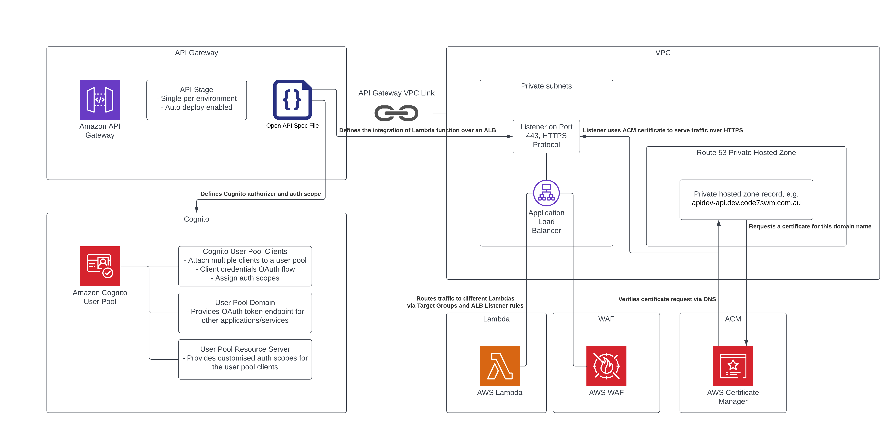

***Note that this is a high level description of the API gateway stack and how the componentes are wired together. It is not meant to be accurate to detail.***

### API Gateway stack
There are 7 components in the API gateway stack.
1. API Gateway
1. Cognito
1. Application Load Balancer
1. Route 53 Private Hosted Zone Record
1. Lambda Function
1. Web Application Firewall
1. AWS Certificate Manager

##### API Gateway
This creates an HTTP API with an OpenAPI spec file. A stage is also created with auto deploy enabled so that changes are automatically deployed to the API.
The OpenAPI spec file defines the Cognito Authorizer details and the integrations with the ALB. Multiple authorizers can be defined so that each API path may have its own authorizer if needed.

##### Cognito
A Cognito user pool is created, and attached are the user pool clients, a user pool domain and a user pool resource server.
- The user pool domain creates an OAuth token endpoint
- Customised auth scopes are defined within the user pool resource server
- The user pool clients can each have its own auth scopes to limit which APIs can be called by a caller
- Each caller can be identified/authenticated by the user pool client's app ID and app secret

###### Rotation of the credentials can be done in the following steps:
1. Create a new `AWS::Cognito::UserPoolClient` resource and give it a timestamped suffix in resource name. You can dupilicate an existing one.
1. Add the resource logic name to the `jwtConfiguration` - `audience` list in the OpenAPI spec file.
1. Run the API pipeline to deploy the changes. A new set of credentials is generated with the stack update. At this point, the authorizer should accept both old and new credentials (grace period).
1. Distribute the new set of credentials to the caller.
1. Once the caller has moved to the new credentials, delete the old user pool clieng resource from the CloudFormation template as well as the OpenAPI spec file.
1. Run the API pipeline again to remove the old credentials.

##### Application Load Balancer
The ALB is an integration point between the API Gateway and the Lambda Function. A listener listens on Port 443 with HTTPS protocol. A certificate is provided by ACM. API Gateway integration is addressed to the listener, and traffic goes through the VPC link over AWS internal network. The listener forwards the request to a target group which targets the backend Lambda function.

##### Route 53 Private Hosted Zone Record
A private record is created in Route 53 hosted zone so an internal domain name can be used to generate a certificate for the ALB listener. The private record is also used in the OpenAPI spec file in `tlsConfig` section.

##### Lambda Function
Processes the business logic of the integration.

##### Web Application Firewall
A WebACL is associated with the ALB to provide some protection against common web attacks e.g. SQL injection attack.

##### AWS Certificate Manager
ACM generates a certificate which is used by the ALB listener. By using DNS validation, the whole process is automated and the certificate is eligible for automatic renewal.