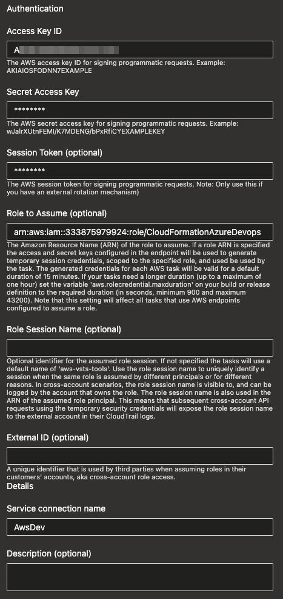

# Creating a new account

## Azure DevOps Service Connection

Before any automation can happen, an account needs to be hooked up to a service connection.

To do this, you will need to run the cfn template at `cfn/templates/platform/account-azureDevOps.yaml`.  This will create an IAM users and role for AzDo to use.

    aws cloudformation update-stack --capabilities CAPABILITY_AUTO_EXPAND CAPABILITY_IAM CAPABILITY_NAMED_IAM \
      --stack-name account-azureDevOps --template-body "$(cat cfn/templates/platform/account-azureDevOps.yaml)"

This will create a secret called `CloudFormationAzdo` that contains the access key and secret.  The role ARN for the AzDo service connection is `arn:aws:iam::<account number>:role/CloudFormationAzureDevops`.

The service connection can now be created in AzDo:

## Networking preparation

To set up new accounts with a VPC, subnets, Internet Gateways, NAT gateways and route tables
follow the below process before Deploying Resources.  To create the virtual gateway appliance required for the direct
connect link back to SWM read the Virtual Gateway md file in docs after deploying resources.

The below steps will configure an account with the VPC and networking configuration required for the 
SWM middleware layer AWS accounts.

The below resources will be created:
    - 11 x SSM parameters
    - 1 x VPC
    - 3 x private subnets
    - 3 x public subnets
    - 3 x restricted subnets
    - 1 x internet gateway
    - 3 x NAT gateway
    - 1 public route table with routes
    - 3 x private route tables with routes
    - 1 x restricted subnet route table
    - 1 x security group

1. Navigate to the parameters folder under the cfn folder within this repo.
2. Select the relevant parameter file. e.g. dev, nonprod or prod file or create a new one as required.
3. Confirm the settings listed in the parameter file are correct.
4. Add the parameter stack template to the AWS cloudformation console manually. 

## Deploying resources

Create the SSM Parameter for the Project Prefix.  This is the prefix for resources that need to be globally unique (e.g. S3 buckets)

    aws ssm put-parameter --name ProjPrefix --value swmi --type String

Add the account and service connection details to `pipelines/platform/account.yaml`

Run the pipeline in Azure Devops at `\integration\platform\account` for the new account.

# Creating a new environment

Ensure the environment parameter and the corresponding service connection (which ties it to an account) are added in `pipelines/platform/environment.yaml`.

Run the pipeline at `pipelines/platform/environment.yaml` for your new environment.

You should now have the required infrastructure in place to deploy specific integrations.  For that, follow the relevant docs for those integrations. 

