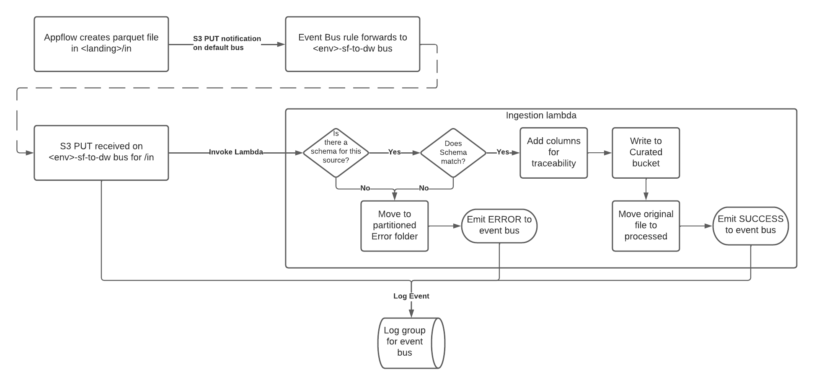
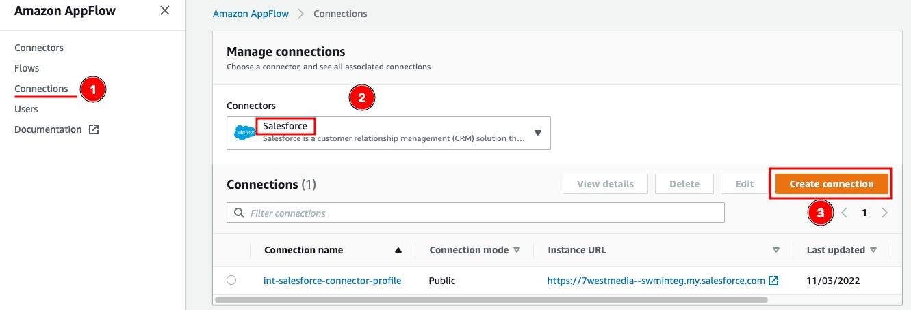

# Salesforce to Data Warehouse

## Introduction

This integration ingests delta and full loads from Salesforce via AppFlow and presents them in a curated table ready for ETL in to the various data warehouses.

## Integration overview

### Appflow

Appflow runs on a schedule and places parquet files that correspond to objects in salesforce.  For the delta flows, the first load will be a full load and then subsequent loads will be deltas from the previous hour.  These files are written to the landing bucket under the `in` folder.

### Event bus

All events related to this pipeline are sent via the `<env>-sf-to-dw` event bus.  AWS native events (e.g. related S3 notifications or scheduled triggers) are forwarded to this bus before handling.

All events on this bus are also consumed by the `/aws/events/<env>-sf-to-dw` log group in CloudWatch logs for traceability.

### Ingestion Lambda

The ingestion lambda acts on the S3 notification (forwarded to the bus) and performs some sanity checks (see diagram).  If any of these checks fail, an error is emitted to the bus (and subsequently captured by logs) and the file is moved to the error folder in the same bucket, partitioned by hour.  If it is successful, the file is moved to processed in the same bucket  (again partitioned by bour) and a new file with some tracability fields added (e.g. filename, time etc) and written to the `curated` bucket for ingestion by the ETL processes.

## Setting up

### Appflow connector

Firstly a Salesforce Appflow connection must exist.  This needs to be created manually once per Salesforce environment in each account that needs connectivity and requires a user with sufficient permissions in Salesforce to set up.

From the Appflow dashboard:

Then create the parameter for your current environment containing the name of your connection.

For example:

    aws ssm put-parameter --name /sit/salesforce/connectorName --value int-salesforce-connector-profile --type String

### Appflow flows and ingestion lambdas

Once the connection is in place, you should be ready to run the deployment pipeline at `\integration\e2e\sf-to-dw`. 
The pipeline will deploy the resources described in the templates in `/cfn/templates/sf-to-dw`.  This will create and enable the flows and set up the event buses, rules and lambda described above.

# Deploying

The following platform stacks are dependencies that should have been brought in by the account and environment pipelines:

1. account-appflow-utilities 
2. environment-kms
3. environment-ecr

They can all be deployed via the `\integration\platform\environment` pipeline. 

The following config is needed in SSM:

| param                                 | value                                  | example                                                                          |
|---------------------------------------|----------------------------------------|----------------------------------------------------------------------------------|
| ${EnvPrefix}/salesforce/connectorName | (manual) name of the Appflow connector | int-salesforce-connector-profile                                                 |
| /kms/arn/${EnvPrefix}-s3              | (automated) reference to KMS key ARN   | arn:aws:kms:ap-southeast-2:[REDACTED_AWS_ACCOUNT_ID]:key/[REDACTED_KMS_KEY_ID] |

